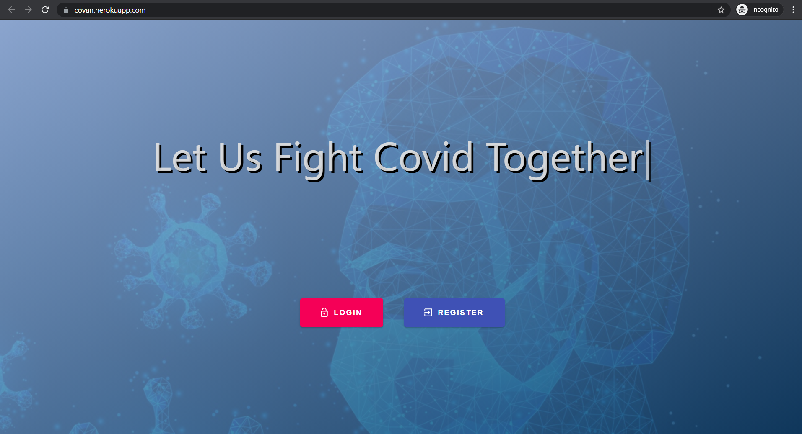
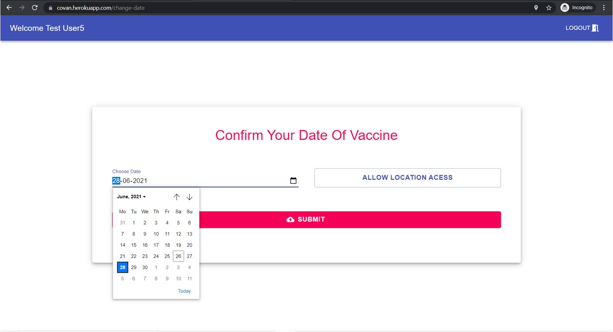
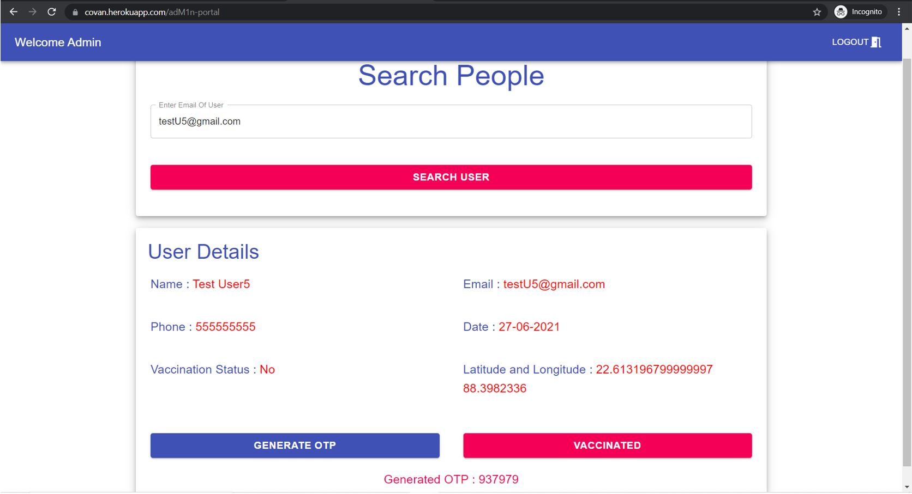
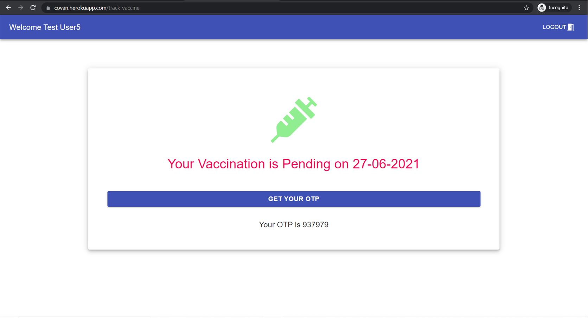
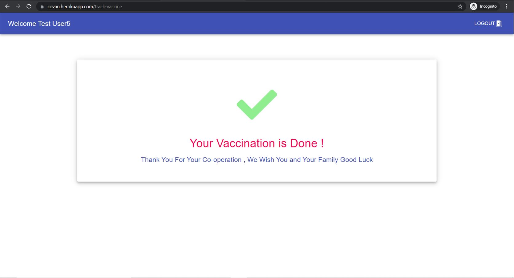
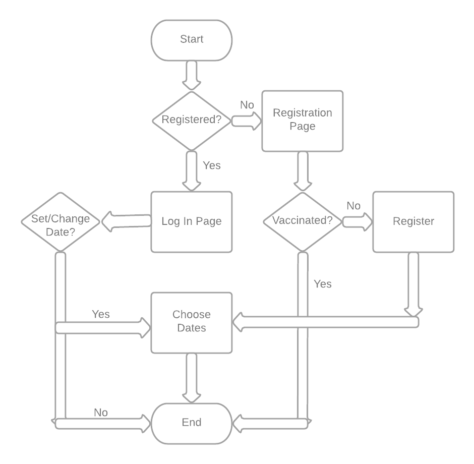

<h1 align="center">coVan</h1>

Detecting availability of vaccine in the client’s area on the specified
‘preferred date’ and sending a vaccination van to the client’s location after checking the vaccination status (whether client has already received the first or second dose.)

## Problem and our approach :
Covid – 19 has been declared as a global pandemic and each and every individual is being advised to take two doses of the covid vaccine. But it’s easier said than done. In a country like ours, with it’s humongous 136.64 crores (2019) it’s often not easy to accommodate all of the vaccine applicants when the no. of vaccination centers are limited. Not only that, but the crowding in the vaccination centers itself has caused a lot of non-covid patients to be affected by this disease.

But what if instead of the people going to the vaccine, the vaccine itself came to the people?

Here’s where this web-site comes in…
- The user has to register themselves into the web-site using just their name, phone number and preferred date of vaccination.
- The site checks it’s database to see whether the registered user is already vaccinated or not. If not vaccinated the user proceeds to the next step.
- If not vaccinated the user is prompted to click on a button to proceed, which registers the user into the site, with a default status of ‘not vaccinated’ and as per the location of the user(which can be obtained using some simple java-script) the site does an API call to https://apisetu.gov.in/public/marketplace/api/cowin to obtain the availability status of the vaccines in that area.
- If not available, the user is prompted to suggest another date.
- On the D-day a vaccination van with proper cold storage(to prevent breaking the cold-chain) is sent to the nearby hospitals or covid centers to collect the vaccine and get to the given location where both the user and the trained medical professional both receive a random OTP(same for both, obviously) for verification purposes.
- On being vaccinated, the status of the user is changed to ‘vaccinated-1’ or ‘vaccination complete’ based on the no. of doses received by the individual, in order to ensure that the same person doesn’t register twice.
- The web-site arranges the registered user in decreasing order of age, the older the individual, higher the preference.

<h3 align='center'>Home</h3>

<h3 align='center'>change-date</h3>

One of the administrators of each of the hospital is given admin privileges to control the activities related to that particular hospital (Finding out names of patients to be vaccinated, marking their profiles as vaccinated when done.)
They have a different portal on the site where they can check which user to vaccinate on which day and on requesting obtains the address of the user from the database. They can generate an OTP, which is sent to both the client and the health-worker for verification purposes. On vaccination, the user’s data is updated to “vaccinated”!

<h3 align='center'>Admin-Portal</h3>

<h3 align='center'>Before Vaccination</h3>

<h3 align='center'>After Vaccination</h3>

<h3 align='center'>Client's UI</h3>

## Problems :
Unavailability of proper API to see the vaccination status of individuals, hence we are depending on the user to provide correct details.

## Technologies used :
- Backend – Node js, Express
- Database - MongoDB
- Frontend - React, Reactbootstrap/Bootstrap
